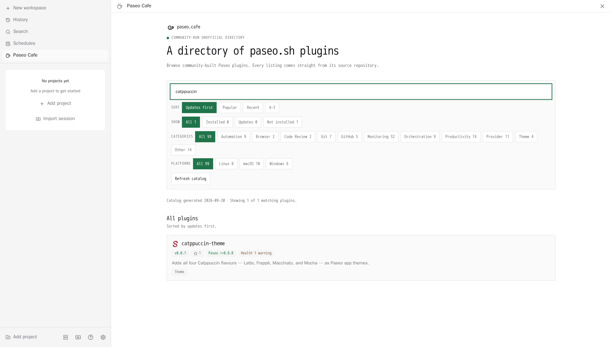
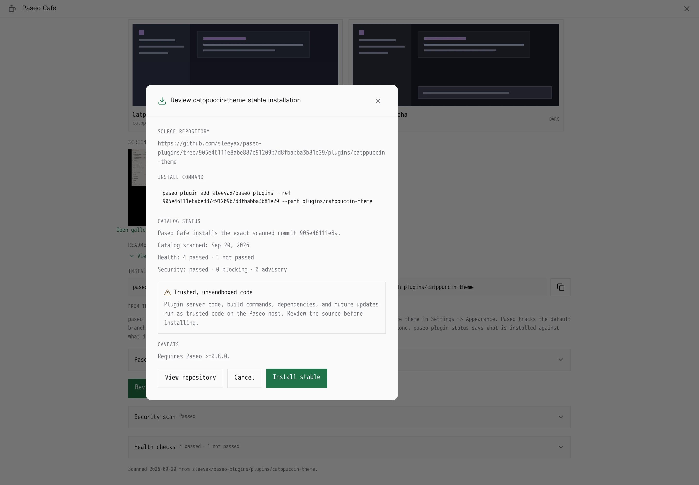

# Paseo Cafe

Browse the [paseo.cafe](https://paseo.cafe) plugin catalog from inside Paseo, and install
plugins without leaving the app.

The plugin adds a **Paseo Cafe** sidebar surface listing every plugin in the catalog with its
description, categories, platforms, Paseo version requirement, caveats, health checks, and
screenshots. Searching and filtering happen on the client; installing runs `paseo plugin add`
on the daemon host behind a confirmation step. A **Paseo plugin** composer attachment source
lets you attach a plugin's full listing to a prompt when you want an agent to review it before
you trust it.

## Screenshots

### Browse and filter the catalog



### Review a plugin before installation



## Install

```bash
paseo plugin add paseo-cafe/paseo-cafe:plugin
```

Requires a Paseo 0.8 release; the manifest declares `requirements.paseo` as `^0.8.0`.

By default the catalog is read from `https://paseo.cafe/api/plugins`. Point **Settings →
Plugins → Paseo Cafe** at another deployment (a local `bun run dev`, a staging build, or a
self-hosted fork) that serves the same shape. `PASEO_CAFE_DIRECTORY_URL` on the daemon is a
lower-priority fallback for hosts that cannot persist plugin settings.

A custom catalog must use HTTPS, or HTTP on loopback (`localhost`, `*.localhost`,
`127.0.0.0/8`, `[::1]`). The catalog picks which repositories the install button hands to the
`paseo` CLI, so anyone able to rewrite a plaintext response chooses what gets installed on the
daemon host.

## Limitations

- Plugins listed here are community-submitted and are not vetted by paseo.cafe. They are
  trusted, unsandboxed code on your daemon host: read the source before installing.
- Installing shells out to the `paseo` CLI, so that binary must be on the daemon's `PATH`.
- The composer attachment source always searches the default catalog. Paseo calls an
  attachment search with the query alone, and a plugin's server handler cannot read its own
  settings, so a custom Catalog URL applies to the sidebar surface only.
- Catalog responses are cached on the daemon for five minutes. **Refresh** bypasses that cache.
