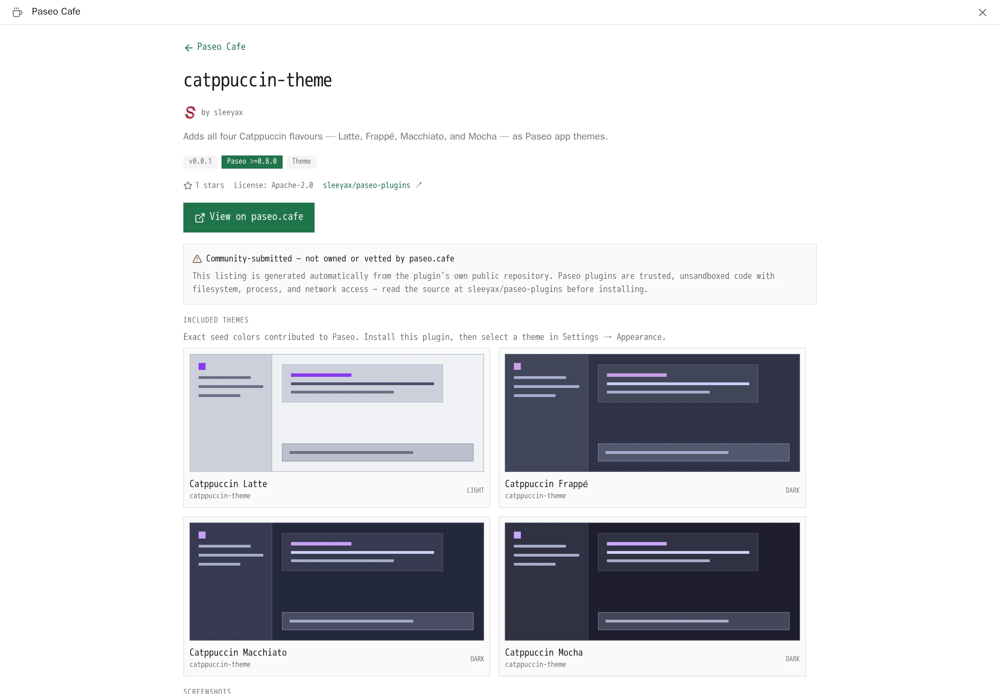
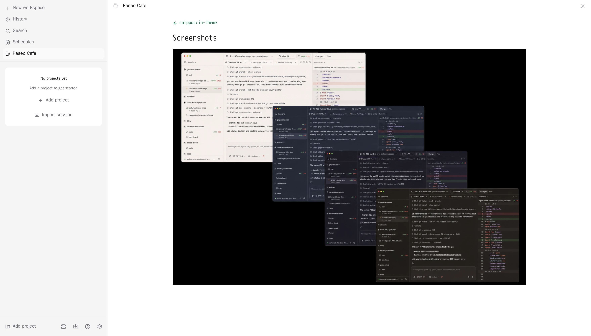

# Paseo Cafe

Browse the [paseo.cafe](https://paseo.cafe) plugin catalog from inside Paseo, and install
plugins without leaving the app.

The plugin adds a **Paseo Cafe** sidebar surface listing every plugin in the catalog with its
package version, description, categories, platforms, Paseo version requirement, caveats, health
checks, and screenshots. npm-backed plugins appear before Git-only plugins and rank by 30-day
downloads then exact-version publish date; Git-only plugins retain their star-based ordering.
Search and filtering happen on the client. Installs run
`paseo plugin add` on the daemon host behind a confirmation step. A **Paseo plugin** composer
attachment source can attach the plugin's full listing to a prompt for agent review before you
trust it.

Update availability is based on package semver. The catalog accepts packages from npmjs only and
pins the scanner-resolved version; Paseo resolves that exact package/version through the daemon
host's npm configuration. Paseo 0.8 installs the exact security-scanned Git commit instead; those
legacy installs remain pinned until reinstalled or moved to Paseo 0.9. Existing installations
always update from their installed source using the exact catalog version or commit.

When a package publishes a distinct `next` dist-tag, the detail page offers that exact scanned
version as an opt-in Preview. Stable remains the default. Preview users receive updates from the
preview channel until they explicitly return to stable.

Automatic updates are opt-in per reviewed npm installation. Enable them from the plugin detail
page; Cafe checks shortly after startup and every six hours, always following that installation's
selected Stable or Preview channel. Updates install the exact security-scanned catalog version,
never downgrade, and isolate failures between plugins. Cafe's own updates still require explicit
confirmation so its restart-safe handoff remains intact. **Settings → Plugins → Paseo Cafe → Check
now** runs the same policy immediately.

## Screenshots

### Browse the Catppuccin theme cards


### Review a plugin before installation


### Inspect plugin details and theme previews



### Browse a plugin's screenshot gallery



## Install

```bash
paseo plugin add paseo-cafe/paseo-cafe:plugin
```

Supports Paseo 0.8 and 0.9 releases; the manifest declares `requirements.paseo` as
`>=0.8.0 <0.10.0`.

By default the catalog is read from `https://paseo.cafe/api/plugins`. Point **Settings →
Plugins → Paseo Cafe** at another deployment (a local `bun run dev`, a staging build, or a
self-hosted fork) that serves the same shape. `PASEO_CAFE_DIRECTORY_URL` on the daemon is a
lower-priority fallback for hosts that cannot persist plugin settings.

A custom catalog must use HTTPS, or HTTP on loopback (`localhost`, `*.localhost`,
`127.0.0.0/8`, `[::1]`). The catalog picks which public npmjs package or GitHub repository the
install button hands to the `paseo` CLI, so anyone able to rewrite a plaintext response chooses
what gets installed on the daemon host.

## Limitations

- Plugins listed here are community-submitted and are not vetted by paseo.cafe. They are
  trusted, unsandboxed code on your daemon host: read the source before installing.
- Installing shells out to the `paseo` CLI, so that binary must be on the daemon's `PATH`.
- Git installs and updates of this companion plugin run `npm ci --omit=dev` so its server-side
  semver dependency is available in the managed checkout.
- On Paseo 0.8, composer attachment searches use the default catalog because that server API
  cannot read plugin settings. Paseo 0.9 attachment searches honor the configured Catalog URL.
- Catalog responses are cached on the daemon for five minutes. **Refresh** bypasses that cache.
